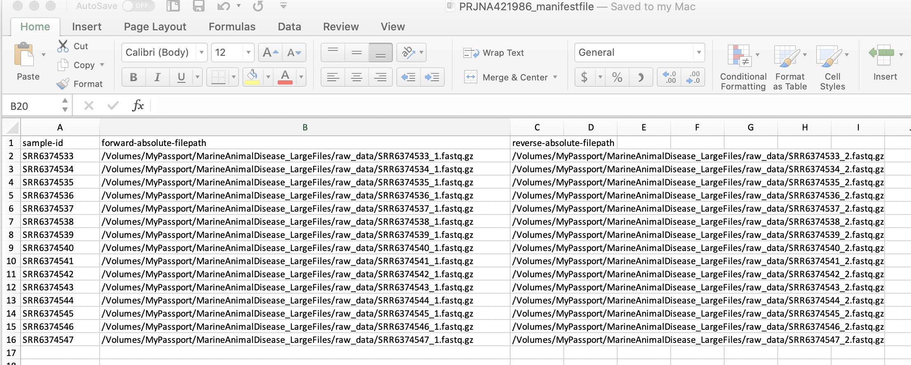

# Importing SRA files into QIIME2, example

In this example, I download fastq files from SRA by following the [Pulling SRA Data](https://github.com/lizsuter/MarineAnimalDisease/blob/master/PullingSRAdata.md) tutorial then import them into QIIME2

I am using [BioProject# PRJNA421986](https://www.ncbi.nlm.nih.gov/bioproject/?term=PRJNA421986&utm_source=gquery&utm_medium=search)

We need a list of all the accession numbers from the project. From BioProject page: click on the SRA experiments > Send to> File> Format: Accession list.  

Then, get rid of the hard returns in the `SraAccList.txt` file


```bash
tr '\n' ' ' < SraAccList.txt
```

    SRR6374533 SRR6374534 SRR6374535 SRR6374536 SRR6374537 SRR6374538 SRR6374539 SRR6374540 SRR6374541 SRR6374542 SRR6374543 SRR6374544 SRR6374545 SRR6374546 SRR6374547  

Next you can copy and paste the output SRA file names from in order to run `fastq-dump`


```bash
cd raw_data
```


```bash
fastq-dump --split-files SRR6374533 SRR6374534 SRR6374535 SRR6374536 SRR6374537 SRR6374538 SRR6374539 SRR6374540 SRR6374541 SRR6374542 SRR6374543 SRR6374544 SRR6374545 SRR6374546 SRR6374547 
```

    Read 191063 spots for SRR6374533
    Written 191063 spots for SRR6374533
    Read 202603 spots for SRR6374534
    Written 202603 spots for SRR6374534
    Read 249572 spots for SRR6374535
    Written 249572 spots for SRR6374535
    Read 185346 spots for SRR6374536
    Written 185346 spots for SRR6374536
    Read 185933 spots for SRR6374537
    Written 185933 spots for SRR6374537
    Read 210893 spots for SRR6374538
    Written 210893 spots for SRR6374538
    Read 220016 spots for SRR6374539
    Written 220016 spots for SRR6374539
    Read 173835 spots for SRR6374540
    Written 173835 spots for SRR6374540
    Read 210508 spots for SRR6374541
    Written 210508 spots for SRR6374541
    Read 215145 spots for SRR6374542
    Written 215145 spots for SRR6374542
    Read 220658 spots for SRR6374543
    Written 220658 spots for SRR6374543
    Read 191533 spots for SRR6374544
    Written 191533 spots for SRR6374544
    Read 234844 spots for SRR6374545
    Written 234844 spots for SRR6374545
    Read 139046 spots for SRR6374546
    Written 139046 spots for SRR6374546
    Read 167426 spots for SRR6374547
    Written 167426 spots for SRR6374547
    Read 2998421 spots total
    Written 2998421 spots total


```bash
ls 
```

    SRR6374533_1.fastq	SRR6374538_1.fastq	SRR6374543_1.fastq
    SRR6374533_2.fastq	SRR6374538_2.fastq	SRR6374543_2.fastq
    SRR6374534_1.fastq	SRR6374539_1.fastq	SRR6374544_1.fastq
    SRR6374534_2.fastq	SRR6374539_2.fastq	SRR6374544_2.fastq
    SRR6374535_1.fastq	SRR6374540_1.fastq	SRR6374545_1.fastq
    SRR6374535_2.fastq	SRR6374540_2.fastq	SRR6374545_2.fastq
    SRR6374536_1.fastq	SRR6374541_1.fastq	SRR6374546_1.fastq
    SRR6374536_2.fastq	SRR6374541_2.fastq	SRR6374546_2.fastq
    SRR6374537_1.fastq	SRR6374542_1.fastq	SRR6374547_1.fastq
    SRR6374537_2.fastq	SRR6374542_2.fastq	SRR6374547_2.fastq


Next, zip the files


```bash
gzip *.fastq
```


```bash
ls
```

    SRR6374533_1.fastq.gz	SRR6374538_1.fastq.gz	SRR6374543_1.fastq.gz
    SRR6374533_2.fastq.gz	SRR6374538_2.fastq.gz	SRR6374543_2.fastq.gz
    SRR6374534_1.fastq.gz	SRR6374539_1.fastq.gz	SRR6374544_1.fastq.gz
    SRR6374534_2.fastq.gz	SRR6374539_2.fastq.gz	SRR6374544_2.fastq.gz
    SRR6374535_1.fastq.gz	SRR6374540_1.fastq.gz	SRR6374545_1.fastq.gz
    SRR6374535_2.fastq.gz	SRR6374540_2.fastq.gz	SRR6374545_2.fastq.gz
    SRR6374536_1.fastq.gz	SRR6374541_1.fastq.gz	SRR6374546_1.fastq.gz
    SRR6374536_2.fastq.gz	SRR6374541_2.fastq.gz	SRR6374546_2.fastq.gz
    SRR6374537_1.fastq.gz	SRR6374542_1.fastq.gz	SRR6374547_1.fastq.gz
    SRR6374537_2.fastq.gz	SRR6374542_2.fastq.gz	SRR6374547_2.fastq.gz


In order to get the files into QIIME2, we are going to use the [manifest format](https://docs.qiime2.org/2020.2/tutorials/importing/). That requires making a manifest file which directs QIIME to the correct fastq files for each sample. And then the quickest way to make the manifest file is manually (since you likely don't have that many samples). The next few steps are helpful in getting the data to put in the manifest file:

Use `ls` to get a list of all files which end in `_1.fastq.gz` (forward reads) and their directory locations (with `$PWD`)


```bash
ls "$PWD"/raw_data/*_1.fastq.gz* 
```

    /Volumes/MyPassport/MarineAnimalDisease_LargeFiles/raw_data/SRR6374533_1.fastq.gz
    /Volumes/MyPassport/MarineAnimalDisease_LargeFiles/raw_data/SRR6374534_1.fastq.gz
    /Volumes/MyPassport/MarineAnimalDisease_LargeFiles/raw_data/SRR6374535_1.fastq.gz
    /Volumes/MyPassport/MarineAnimalDisease_LargeFiles/raw_data/SRR6374536_1.fastq.gz
    /Volumes/MyPassport/MarineAnimalDisease_LargeFiles/raw_data/SRR6374537_1.fastq.gz
    /Volumes/MyPassport/MarineAnimalDisease_LargeFiles/raw_data/SRR6374538_1.fastq.gz
    /Volumes/MyPassport/MarineAnimalDisease_LargeFiles/raw_data/SRR6374539_1.fastq.gz
    /Volumes/MyPassport/MarineAnimalDisease_LargeFiles/raw_data/SRR6374540_1.fastq.gz
    /Volumes/MyPassport/MarineAnimalDisease_LargeFiles/raw_data/SRR6374541_1.fastq.gz
    /Volumes/MyPassport/MarineAnimalDisease_LargeFiles/raw_data/SRR6374542_1.fastq.gz
    /Volumes/MyPassport/MarineAnimalDisease_LargeFiles/raw_data/SRR6374543_1.fastq.gz
    /Volumes/MyPassport/MarineAnimalDisease_LargeFiles/raw_data/SRR6374544_1.fastq.gz
    /Volumes/MyPassport/MarineAnimalDisease_LargeFiles/raw_data/SRR6374545_1.fastq.gz
    /Volumes/MyPassport/MarineAnimalDisease_LargeFiles/raw_data/SRR6374546_1.fastq.gz
    /Volumes/MyPassport/MarineAnimalDisease_LargeFiles/raw_data/SRR6374547_1.fastq.gz
    (qiime2-2020.2) 


Then copy the above into a column in Excel or GoogleSheets

Do the same for the reverse reads and copy these into another column. Do a spotcheck to make sure all forward and reverse reads are matched in the same row


```bash
ls "$PWD"/raw_data/*_2.fastq.gz*
```

    /Volumes/MyPassport/MarineAnimalDisease_LargeFiles/raw_data/SRR6374533_2.fastq.gz
    /Volumes/MyPassport/MarineAnimalDisease_LargeFiles/raw_data/SRR6374534_2.fastq.gz
    /Volumes/MyPassport/MarineAnimalDisease_LargeFiles/raw_data/SRR6374535_2.fastq.gz
    /Volumes/MyPassport/MarineAnimalDisease_LargeFiles/raw_data/SRR6374536_2.fastq.gz
    /Volumes/MyPassport/MarineAnimalDisease_LargeFiles/raw_data/SRR6374537_2.fastq.gz
    /Volumes/MyPassport/MarineAnimalDisease_LargeFiles/raw_data/SRR6374538_2.fastq.gz
    /Volumes/MyPassport/MarineAnimalDisease_LargeFiles/raw_data/SRR6374539_2.fastq.gz
    /Volumes/MyPassport/MarineAnimalDisease_LargeFiles/raw_data/SRR6374540_2.fastq.gz
    /Volumes/MyPassport/MarineAnimalDisease_LargeFiles/raw_data/SRR6374541_2.fastq.gz
    /Volumes/MyPassport/MarineAnimalDisease_LargeFiles/raw_data/SRR6374542_2.fastq.gz
    /Volumes/MyPassport/MarineAnimalDisease_LargeFiles/raw_data/SRR6374543_2.fastq.gz
    /Volumes/MyPassport/MarineAnimalDisease_LargeFiles/raw_data/SRR6374544_2.fastq.gz
    /Volumes/MyPassport/MarineAnimalDisease_LargeFiles/raw_data/SRR6374545_2.fastq.gz
    /Volumes/MyPassport/MarineAnimalDisease_LargeFiles/raw_data/SRR6374546_2.fastq.gz
    /Volumes/MyPassport/MarineAnimalDisease_LargeFiles/raw_data/SRR6374547_2.fastq.gz
    (qiime2-2020.2) 


Next, take a look at the SraRunTable (from BioProject page, Click SRA Experiments> Click Send results to Run selector> Select all SRA experiments in table> In 'Select' Click Metadata under Total> Download)

Look for sample IDs from the SraRunTable. You want to grab these and paste them into the manifest file, while making sure you are matching the correct SRA accession number to the correct sample-id (they SHOULD be in the same order but double check.)

In my case, the sample-ids were listed under `LibraryName`.

Put in column names `sample-id`, `forward-absolute-filepath`, and `reverse-absolute-filepath`.

At the end, your manifest file should look something like this in Excel:





Save the above file as a tab-delimited `.tsv`. NOTE: you may have to save as a `.txt` tab-delimited file then manually change the extension from `.txt` to `.tsv`.

Next we open QIIME and get ready to import as a QIIME object


```bash
source activate qiime2-2020.2
```

    bash: activate: No such file or directory
    (qiime2-2020.2) 


```bash
qiime info
```

    System versions
    Python version: 3.6.7
    QIIME 2 release: 2020.2
    QIIME 2 version: 2020.2.0
    q2cli version: 2020.2.0
    
    Installed plugins
    alignment: 2020.2.0
    composition: 2020.2.0
    cutadapt: 2020.2.0
    dada2: 2020.2.0
    deblur: 2020.2.0
    demux: 2020.2.0
    diversity: 2020.2.0
    emperor: 2020.2.0
    feature-classifier: 2020.2.0
    feature-table: 2020.2.0
    fragment-insertion: 2020.2.0
    gneiss: 2020.2.0
    longitudinal: 2020.2.0
    metadata: 2020.2.0
    phylogeny: 2020.2.0
    quality-control: 2020.2.0
    quality-filter: 2020.2.0
    sample-classifier: 2020.2.0
    taxa: 2020.2.0
    types: 2020.2.0
    vsearch: 2020.2.0
    
    Application config directory
    /opt/anaconda3/envs/qiime2-2020.2/var/q2cli
    
    Getting help
    To get help with QIIME 2, visit https://qiime2.org
    (qiime2-2020.2) 


If you look at the documentation about the manifest files again, you'll see there's a few options here. First, we have a F and R read for each sample, so we definitely have paired-end data. Second, we have to know which "Phred" to use...

Phred is essentially a code for the quality of each base pair in the fastq file. Each bp is associated with a letter or symbol that correpsonds to a quality score, from 1 to 43 (the code is explained [here](https://www.drive5.com/usearch/manual/quality_score.html). This is  what QIIME reads later when we look at quality profiles. There are two Phred "codes", the older one, Phred64, and the newer one, Phred33. You likely have Phred33 fastq files but you can take a peak at a fastq file to be sure. If there are a lot of symbols everywhere, like this:


Then you have Phred33. The Phred64 code is only letters.

So let's tell QIIME we have paired end reads with PHRED33 scores when we import, and direct it to our manifest file:


```bash
ls
```

    PRJNA421986_biosample_metadata.txt	SraRunTable.xlsx
    PRJNA421986_manifestfile.tsv		biosample_result.txt
    SRA_into_QIIME.ipynb			forwardreads.txt
    SRR6374535_2.fastq			images
    SRR6374535_2.fastq.gz			raw_data
    SraAccList.txt				reversereads.txt
    SraRunTable.txt				test
    (qiime2-2020.2) 


```bash
qiime tools import \
  --type 'SampleData[PairedEndSequencesWithQuality]' \
  --input-path PRJNA421986_manifestfile.tsv \
  --output-path paired-end-demux.qza \
  --input-format PairedEndFastqManifestPhred33V2
```

    Imported PRJNA421986_manifestfile.tsv as PairedEndFastqManifestPhred33V2 to paired-end-demux.qza
    (qiime2-2020.2) 


That works! Once imported as .qza file, you can continue with the rest of the tutorial
